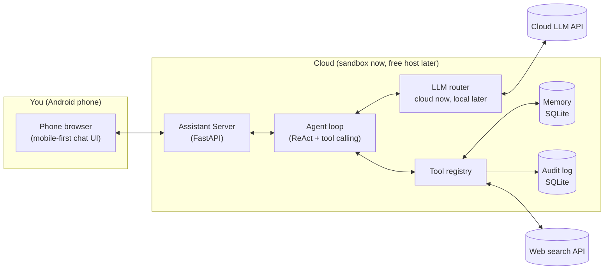

# JARVIS MVP — Technical Plan (Rev 2)

> **Vision:** A personal AI assistant like Jarvis.
> **MVP:** A chat-first assistant with a mobile-friendly web UI that runs in the cloud:
> smart chat + everyday skills (time, web search, notes/todos, reminders, memory).
> Voice and on-device automation come after MVP.
> **Brain:** Hybrid — cloud LLM API now, swappable to local models later.

**Rev 2 — 2026-09-10: mobile-dev pivot.** Developer is on Android with no PC, building in the
Arena sandbox and testing in the phone browser. PC-control pack dropped from MVP (no target
machine); everything is cloud-based. Rev 1 kept for reference in git history.

**Session decisions:**
| Decision | Choice |
|---|---|
| Interaction | Chat-first, voice later |
| Interface | Web UI (mobile-first, works on phone browser) |
| Runs on | Cloud (Arena sandbox now → free host in Phase 4) |
| MVP skills | Cloud daily-helper pack (search, notes/todos, reminders, memory) |
| Brain | Hybrid (cloud API now, local-ready) |
| Dev environment | Arena sandbox + live preview on phone |
| Stack | Recommended by agent (below) |

---

## 1. MVP definition

### In scope
- Mobile-first web chat UI (big touch targets, works in phone browser)
- Smart chat backed by a cloud LLM, conversation history
- Everyday skills (all cloud-side, no device access needed):
  - Current time/date (user timezone: Asia/Kolkata)
  - Web search + page fetch (grounded answers)
  - Notes, todos, reminders
  - Long-term memory ("remember that I…")
  - Workspace files (list/read project files — for dev help, not device control)
  - Calculator / unit conversion
- Audit log of tool calls (visible in UI or API)

### Out of scope (post-MVP)
- ~~PC control~~ — dropped: no target computer. Revisit only if a PC appears.
- Voice I/O + wake-word (hooks reserved — see §7)
- Android on-device automation (Termux:API / Tasker bridge — needs on-phone setup)
- Telegram/WhatsApp bot interface (natural Phase 5 — great on mobile)
- Smart-home control, email/calendar deep integrations
- Fully offline local LLM (supported by design, tuned later)

### MVP success criteria
1. Open the preview URL on your phone → chat works, replies stream in < 5s.
2. "Search the web for X", "remind me in 10 minutes", "remember I like…" all work.
3. LLM provider swappable (Claude ↔ GPT ↔ Gemini ↔ Ollama) via config, not code.
4. Deployable to a free host so it survives beyond this sandbox (Phase 4).

---

## 2. Key user flows

**F1 — Chat:** Type message → streamed LLM reply. No tools needed.
**F2 — Skill:** "Search for cheap flights…" → LLM calls `web_search` → grounded answer + sources.
**F3 — Memory:** "Remember I take coffee at 7" → `remember` stores fact → used in later answers.
**F4 — Reminder/todo:** "Remind me to call mom at 6pm" → stored → surfaced when due.
**F5 — Dev help:** "What's in my project?" → `list_files` on workspace → answers about your own code.

---

## 3. Architecture

Single cloud service: one Python server serves the API + web UI. No companion agents in MVP.



### Components
| Component | Responsibility | Notes |
|---|---|---|
| Web UI | Chat, history, tool-result cards | Single file, no build step, thumb-friendly |
| Assistant Server | API + serves UI, sessions, rate limits | Python FastAPI, binds `0.0.0.0` for preview |
| Agent loop | Reply directly or call tools, multi-step | Custom ~200-line ReAct loop |
| LLM router | One interface, many providers | Cloud keys now; Ollama endpoint later |
| Tool registry | Declares tools + JSON schemas, validates args | Every skill is a tool |
| Memory | History, profile, facts, todos, reminders | SQLite; vectors later for semantic recall |
| Audit log | What was asked, what ran, what happened | Append-only |

**Sandbox note:** this environment is ephemeral — the SQLite file lives with the workspace while
you develop here, but Phase 4 deploys to a free host with persistent disk so memory survives.

---

## 4. Recommended stack

| Layer | Choice | Why |
|---|---|---|
| Language | **Python 3.11+** | Best AI ecosystem, runs everywhere |
| Server | **FastAPI + Uvicorn** | Async, easy streaming, serves UI too |
| Web UI | **Single HTML file, hand CSS, vanilla JS** | No build step, no CDN dependency, fast on mobile |
| LLM access | **Thin router wrapper** (own code) | `LLM_PROVIDER` env swap: `anthropic` / `openai` / `gemini` / `ollama` |
| Default cloud LLM | Claude or GPT-4-class + cheap fallback | Strong tool-calling; fallback for cost |
| Agent | **Custom tool loop** | Full control, debuggable; LangGraph optional later |
| Memory | **SQLite** | Zero-ops; add `sqlite-vec`/Chroma later |
| Web search | Tavily or Brave API (or DuckDuckGo free) | Grounded answers |
| Dev/preview | **Arena sandbox + live preview** | Zero setup from your phone |
| Deploy (Phase 4) | Render / Railway / Fly free tier | Persistent, phone-accessible URL |
| Config | `.env` + `config.yaml` | Keys, provider, timezone, limits |
| Tests | `pytest` | Tool tests + regression tests |

---

## 5. Data model (SQLite, MVP tables)

```
conversations(id, title, created_at)
messages(id, conversation_id, role, content, tool_calls_json, created_at)
user_profile(key, value)            -- name, timezone, preferences...
facts(id, text, created_at)         -- "remember ..." entries
notes(id, text, created_at)
todos(id, text, done, due_at, created_at)
reminders(id, text, remind_at, done, created_at)
audit_log(id, created_at, tool, args_json, result_summary)
```

Memory strategy: last-N messages in context + profile/facts injected into system prompt.
Semantic search over history = post-MVP (add vectors then).

---

## 6. MVP tool API (what the LLM can call)

All cloud-safe in MVP (no device access), so no confirmation flow needed yet.

| Tool | Args | Does |
|---|---|---|
| `get_time` | — | Current time/date in user timezone |
| `calculate` | `expression` | Safe math evaluation |
| `web_search` | `query` | Web results with sources |
| `fetch_page` | `url` | Page text for grounding |
| `remember` / `recall` | `text` / `query` | Store / fetch long-term facts |
| `note_add` / `note_list` | `text` / — | Quick notes |
| `todo_add` / `todo_list` / `todo_done` | … | Todo list |
| `reminder_add` / `reminder_due` | `text, remind_at` / — | Reminders (server checks due ones) |
| `list_files` | `path` (jailed to workspace) | List project files |
| `read_file` | `path` (jailed, size-capped) | Read a project file |

**Safety rules:**
1. File tools jailed to the project workspace — no system paths, ever.
2. No shell execution in MVP (no `run_command` — nothing to run it on safely).
3. Every tool call → audit log row.
4. API keys only in `.env` (never committed); per-day LLM spend cap in config.

---

## 7. Designing for voice later (hooks, not work)

- `POST /api/chat` accepts `{ text }` — STT just becomes another producer of `text`.
- Replies support `{ text }` — TTS consumes `text` when enabled.
- Tool schemas don't change for voice.
- Post-MVP voice stack: wake-word `openWakeWord` → STT `faster-whisper` → same agent → TTS `Piper` (local) / ElevenLabs (cloud).
- Post-MVP Android bridge: Termux:API/Tasker companion for on-phone actions (battery, location, notifications).

---

## 8. Project structure (target)

```
├── server.py              # FastAPI entry: serves API + web UI
├── config.yaml            # assistant, llm, features, server settings
├── .env                   # keys (never commit) — see .env.example
├── requirements.txt
├── agent/
│   ├── loop.py            # ReAct/tool-calling loop
│   ├── prompts.py         # system prompt builder (profile+facts injected)
│   └── schemas.py         # message/tool-call models
├── llm/
│   └── router.py          # unified chat() + stream() over providers
├── tools/
│   ├── registry.py        # tool registration + validation
│   ├── general.py         # get_time, calculate
│   ├── web.py             # web_search, fetch_page
│   ├── memory_tools.py    # remember/recall/notes/todos/reminders
│   └── workspace.py       # jailed list/read of project files
├── memory/
│   └── store.py           # SQLite access layer
├── web/
│   └── index.html         # chat UI (single file, mobile-first)
├── tests/
│   └── test_tools.py      # tool tests (Phase 2+)
└── PLAN.md                # this file
```

---

## 9. Build phases

| Phase | Goal | Done when |
|---|---|---|
| **0 — Scaffold** ✅ done | Repo layout, config, health endpoint, chat UI + echo stub, live preview | Preview opens on phone, echo chat works, `/health` OK |
| **1 — Chat + brain** 🔨 code done, live test moved to deploy | LLM router (Gemini + demo), real chat, history, streaming | Demo chat works here; real AI chat verified on Render (sandbox blocks LLM APIs) |
| **1.5 — Deploy (pulled forward)** ⏳ next | `render.yaml`, push to GitHub, deploy on Render from phone, set `GEMINI_API_KEY` | Jarvis live at permanent URL with real brain |
| **2 — Tool loop** | Agent loop + registry + `get_time`, `calculate`, `web_search`, `fetch_page`, workspace files | "What time is it / search X / what's in my project" works |
| **3 — Memory + todos** | Profile, facts, notes, todos, reminders (due-check loop) | "Remember…", todos, and a firing reminder all work |
| **4 — Deploy + polish** | Free-host deploy, persistent memory, token auth, README, mobile CSS polish | Lives at a permanent URL, usable daily from phone |
| **5 (post-MVP)** | Telegram bot and/or voice and/or Android bridge | Pick ONE based on how you use the MVP |

Each phase is 1–3 focused sessions. We demo each phase live in your phone browser.

---

## 10. Risks & mitigations

| Risk | Mitigation |
|---|---|
| Sandbox is ephemeral (server sleeps, DB lost) | Phase 4 deploy to free host with disk; keep code in git always |
| Cloud LLM cost | Cheap fallback model, short prompts, daily spend cap |
| Typing code/config on a phone is painful | I write the code; you review, tap, and test — minimal typing for you |
| Scope creep (voice, Telegram, Android bridge too early) | MVP checklist in §1; ideas parked in `BACKLOG.md` |
| API keys on a shared/mobile setup | Keys in `.env` only, never in chat logs or git; token-auth the deploy |

---

## 11. Open questions for you

1. **Which cloud LLM?** Do you have an API key for Anthropic / OpenAI / Gemini? (If none, tell me — I'll recommend the cheapest/easiest to get from India, currently usually Gemini free tier or Claude/GPT pay-as-you-go.)
2. **Name:** keep calling it Jarvis?
3. **Deploy target (Phase 4):** any preference — Render / Railway / Fly.io? (If none, I'll pick the simplest free tier.)
4. **After MVP:** Telegram bot, voice, or Android on-phone actions — which excites you most? (Just for roadmap ordering.)

---

## 12. Immediate next steps

1. ✅ Phases 0–1 code done + pushed (`arena/01a08a6b-new-pa-block`).
2. **You deploy on Render from your phone** (steps in chat) → real Jarvis at a permanent URL.
3. You confirm real chat works there → we build Phase 2 (tool loop + offline tools here, web tools verified on deploy).
